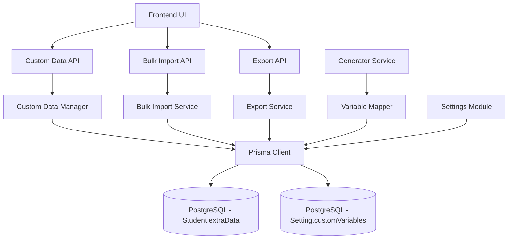

# Design Document: Student Custom Data Sync

## Overview

The Student Custom Data Sync feature extends the existing student management system to support dynamic custom data fields that can be imported, managed, and automatically mapped to template variables during letter generation. This feature eliminates manual data entry for bulk letter generation by allowing administrators to store arbitrary key-value pairs per student and automatically populate template variables.

### Goals

1. Enable storage of arbitrary custom data per student in the existing PostgreSQL database using JSON fields
2. Support bulk import/export of custom data via CSV/Excel files
3. Integrate custom data with the existing generator service for automatic variable replacement
4. Provide CRUD operations through REST API endpoints
5. Maintain backward compatibility with existing student and generator modules

### Non-Goals

1. Complex data transformations or computed fields
2. Data validation beyond basic type checking
3. Historical versioning of custom data changes
4. Custom data relationships between students

## Architecture

### System Context

The feature integrates with three existing modules:

1. **Students Module**: Extended to manage extraData field
2. **Generator Module**: Enhanced to merge custom data during variable replacement
3. **Settings Module**: Extended to store global custom variable definitions

### High-Level Architecture



### Data Flow

#### Import Flow
1. Admin uploads CSV/Excel file
2. Bulk Import Service parses file
3. Service validates NISN column existence
4. For each row: normalize column names, validate data, match NISN
5. Merge custom columns into Student.extraData JSON field
6. Return import report (success count, errors)

#### Generation Flow
1. Admin selects template and students
2. Generator Service retrieves student records
3. Variable Mapper merges standard fields + extraData
4. Handlebars replaces {{variable}} with mapped values
5. Puppeteer generates PDFs with populated data

## Components and Interfaces

### 1. Custom Data Manager

**Responsibility**: CRUD operations on Student.extraData field

**Interface**:
```javascript
class CustomDataManager {
  /**
   * Update custom data for a student
   * @param {string} studentId - Student ID
   * @param {Object} customData - Key-value pairs to merge
   * @returns {Promise<Student>}
   */
  async updateCustomData(studentId, customData);
  
  /**
   * Get custom data for a student
   * @param {string} studentId - Student ID
   * @returns {Promise<Object>}
   */
  async getCustomData(studentId);
  
  /**
   * Delete specific keys from custom data
   * @param {string} studentId - Student ID
   * @param {string[]} keys - Keys to remove
   * @returns {Promise<Student>}
   */
  async deleteCustomDataKeys(studentId, keys);
  
  /**
   * Validate custom data structure
   * @param {Object} customData - Data to validate
   * @returns {Object} - Validation result with errors
   */
  validateCustomData(customData);
}
```

**Implementation Notes**:
- Uses Prisma's JSON field operations
- Performs shallow merge for updates (existing keys preserved unless overwritten)
- Validates that keys are valid strings (alphanumeric + underscore only)
- Stores values as-is (string, number, boolean, date string)

### 2. Bulk Import Service

**Responsibility**: Parse and import custom data from CSV/Excel files

**Interface**:
```javascript
class BulkImportService {
  /**
   * Import custom data from file
   * @param {Buffer} fileBuffer - File content
   * @param {string} mimetype - File MIME type
   * @param {string} originalname - Original filename
   * @returns {Promise<ImportResult>}
   */
  async importCustomData(fileBuffer, mimetype, originalname);
  
  /**
   * Normalize column names
   * @param {string} columnName - Raw column name
   * @returns {string} - Normalized name (lowercase, underscores)
   */
  normalizeColumnName(columnName);
  
  /**
   * Extract custom columns from row
   * @param {Object} row - Parsed row data
   * @returns {Object} - Custom data object
   */
  extractCustomData(row);
}
```

**ImportResult Schema**:
```javascript
{
  importedCount: number,      // Successfully imported rows
  totalRows: number,          // Total rows in file
  skippedCount: number,       // Rows with errors
  errors: [                   // Error details
    { row: number, nisn: string, message: string }
  ],
  warnings: [                 // Non-fatal issues
    { message: string }
  ]
}
```

**Standard Field Mapping**:
The service recognizes these standard fields and maps them to Student model fields (not extraData):
- `nisn`, `NISN` → Student.nisn
- `name`, `nama`, `Nama` → Student.name  
- `grade`, `kelas`, `className` → Student.grade/className
- `gender`, `jenis_kelamin`, `jk` → Student.gender
- `parentName`, `nama_orang_tua`, `parent_name` → Student.parentName
- `parentPhone`, `no_hp_ortu`, `parent_phone` → Student.parentPhone
- `address`, `alamat` → Student.address
- `email` → Student.email

**Custom Data Extraction**:
- All columns NOT matching standard fields are treated as custom data
- Column names normalized: lowercase, spaces→underscores, special chars removed
- Duplicate column names after normalization trigger warning
- Empty cells stored as null in extraData

**Processing Algorithm**:
```
1. Parse file (CSV or Excel)
2. Validate NISN column exists
3. For each row:
   a. Extract NISN value
   b. Find student by NISN
   c. If not found: log error, continue
   d. Separate standard fields vs custom fields
   e. Normalize custom field keys
   f. Merge into Student.extraData (preserving existing keys)
   g. Update Student record
4. Return ImportResult
```

### 3. Export Service

**Responsibility**: Export student data with custom fields to CSV/Excel

**Interface**:
```javascript
class ExportService {
  /**
   * Export student data with custom fields
   * @param {Object} filters - Student filters (grade, class, etc.)
   * @param {string} format - 'csv' | 'xlsx'
   * @returns {Promise<Buffer>}
   */
  async exportStudentData(filters, format);
  
  /**
   * Collect all unique custom keys across students
   * @param {Student[]} students - Student records
   * @returns {string[]} - Sorted unique keys
   */
  collectCustomKeys(students);
}
```

**Export Format**:
- Standard columns: NISN, Name, Grade, Class, Gender, Parent Name, Parent Phone, Address, Email
- Dynamic columns: All unique keys from extraData across selected students
- Empty cells for students missing specific custom fields
- UTF-8 encoding with BOM for Excel compatibility

### 4. Variable Mapper

**Responsibility**: Merge standard and custom data for template variable replacement

**Interface**:
```javascript
class VariableMapper {
  /**
   * Create template data object for a student
   * @param {Student} student - Student record
   * @param {Object} globalData - Global template data (date, etc.)
   * @returns {Object} - Merged data for template
   */
  mapVariables(student, globalData);
  
  /**
   * Get missing variables for a student
   * @param {string[]} requiredVariables - Variables in template
   * @param {Student} student - Student record
   * @returns {string[]} - Missing variable names
   */
  getMissingVariables(requiredVariables, student);
  
  /**
   * Format value by type
   * @param {any} value - Raw value
   * @param {string} type - Expected type hint
   * @returns {string} - Formatted string
   */
  formatValue(value, type);
}
```

**Variable Mapping Strategy**:
1. **Standard Fields** (priority 1): Direct mapping from Student model
   - `{{nama_siswa}}` → Student.name
   - `{{nisn}}` → Student.nisn
   - `{{kelas}}` → Student.className
   - `{{jenis_kelamin}}` → formatted gender
   - `{{nama_orang_tua}}` → Student.parentName
   - `{{no_hp_ortu}}` → Student.parentPhone
   - `{{alamat}}` → Student.address
   - `{{email}}` → Student.email

2. **Custom Fields** (priority 2): From Student.extraData
   - `{{tempat_lahir}}` → extraData.tempat_lahir
   - `{{tanggal_lahir}}` → extraData.tanggal_lahir
   - Any `{{key}}` → extraData.key

3. **Global Fields** (priority 3): System-generated
   - `{{tanggal_surat}}` → current date formatted
   - Any custom global variables from Settings

4. **Missing Variables**: Replaced with empty string or configurable placeholder

**Case Insensitivity**:
- Variable names normalized: lowercase, underscores
- `{{Tempat_Lahir}}` matches `tempat_lahir` in extraData
- `{{TANGGAL-LAHIR}}` matches `tanggal_lahir` in extraData

### 5. API Endpoints

#### Custom Data Management

**Update Custom Data**
```
PATCH /api/students/:id/custom-data
Authorization: Bearer <token>
Content-Type: application/json

Request Body:
{
  "tempat_lahir": "Jakarta",
  "tanggal_lahir": "2005-03-15",
  "asal_sekolah": "SMP N 1 Jakarta"
}

Response (200):
{
  "success": true,
  "message": "Data custom berhasil diperbarui",
  "data": {
    "id": "cuid123",
    "nisn": "1234567890",
    "name": "John Doe",
    "extraData": {
      "tempat_lahir": "Jakarta",
      "tanggal_lahir": "2005-03-15",
      "asal_sekolah": "SMP N 1 Jakarta"
    },
    "updatedAt": "2025-01-15T10:30:00Z"
  }
}
```

**Get Custom Data**
```
GET /api/students/:id/custom-data
Authorization: Bearer <token>

Response (200):
{
  "success": true,
  "data": {
    "tempat_lahir": "Jakarta",
    "tanggal_lahir": "2005-03-15",
    "asal_sekolah": "SMP N 1 Jakarta"
  }
}
```

**Delete Custom Data Keys**
```
DELETE /api/students/:id/custom-data
Authorization: Bearer <token>
Content-Type: application/json

Request Body:
{
  "keys": ["tempat_lahir", "asal_sekolah"]
}

Response (200):
{
  "success": true,
  "message": "Data custom berhasil dihapus",
  "data": {
    "extraData": {
      "tanggal_lahir": "2005-03-15"
    }
  }
}
```

#### Bulk Import/Export

**Bulk Import Custom Data**
```
POST /api/students/custom-data/import
Authorization: Bearer <token>
Content-Type: multipart/form-data

Form Data:
- file: <CSV/Excel file>

Response (200):
{
  "success": true,
  "message": "Import selesai: 245 berhasil, 5 gagal",
  "data": {
    "importedCount": 245,
    "totalRows": 250,
    "skippedCount": 5,
    "errors": [
      { "row": 12, "nisn": "9876543210", "message": "NISN tidak ditemukan" },
      { "row": 45, "nisn": "", "message": "NISN wajib diisi" }
    ],
    "warnings": [
      { "message": "Kolom 'Tempat Lahir' dan 'tempat_lahir' dinormalisasi menjadi sama" }
    ]
  }
}
```

**Export Student Data**
```
GET /api/students/custom-data/export?format=xlsx&grade=X&className=X-A
Authorization: Bearer <token>

Response (200):
Content-Type: application/vnd.openxmlformats-officedocument.spreadsheetml.sheet
Content-Disposition: attachment; filename="students_export_2025-01-15.xlsx"

<Binary file content>
```

#### Custom Variables Management

**Get Global Custom Variables**
```
GET /api/settings/custom-variables
Authorization: Bearer <token>

Response (200):
{
  "success": true,
  "data": {
    "customVariables": [
      "tempat_lahir",
      "tanggal_lahir",
      "asal_sekolah",
      "nama_wali",
      "pekerjaan_ortu"
    ]
  }
}
```

**Update Global Custom Variables**
```
PUT /api/settings/custom-variables
Authorization: Bearer <token>
Content-Type: application/json

Request Body:
{
  "customVariables": [
    "tempat_lahir",
    "tanggal_lahir",
    "asal_sekolah",
    "nama_wali",
    "pekerjaan_ortu",
    "alamat_wali"
  ]
}

Response (200):
{
  "success": true,
  "message": "Daftar variabel custom berhasil diperbarui",
  "data": {
    "customVariables": [...]
  }
}
```

## Data Models

### Database Schema Changes

The `extraData` field already exists in the Student model schema. No migration required.

```prisma
model Student {
  id          String   @id @default(cuid())
  nisn        String   @unique
  name        String
  grade       String
  className   String   @map("class_name")
  gender      Gender
  parentName  String   @map("parent_name")
  parentPhone String?  @map("parent_phone")
  address     String?  @db.Text
  email       String?
  extraData   Json?    @map("extra_data")     // ← Used for custom data
  isActive    Boolean  @default(true) @map("is_active")
  createdAt   DateTime @default(now()) @map("created_at")
  updatedAt   DateTime @updatedAt @map("updated_at")
  
  // ... relations
}
```

**extraData Structure**:
```json
{
  "tempat_lahir": "Jakarta",
  "tanggal_lahir": "2005-03-15",
  "asal_sekolah": "SMP N 1 Jakarta",
  "nama_wali": "Jane Doe",
  "pekerjaan_ortu": "PNS",
  "tinggi_badan": 165,
  "berat_badan": 55,
  "golongan_darah": "A",
  "hobi": "Basket"
}
```

### Settings Model Extension

The `customVariables` field already exists:

```prisma
model Setting {
  id              String   @id @default("global_settings")
  // ... other fields
  customVariables String[] @default([])  // ← List of defined custom variables
  updatedAt       DateTime @updatedAt @map("updated_at")
}
```

## Correctness Properties

*A property is a characteristic or behavior that should hold true across all valid executions of a system—essentially, a formal statement about what the system should do. Properties serve as the bridge between human-readable specifications and machine-verifiable correctness guarantees.*

Before writing properties, I'll analyze the testability of each acceptance criterion using the prework tool.

